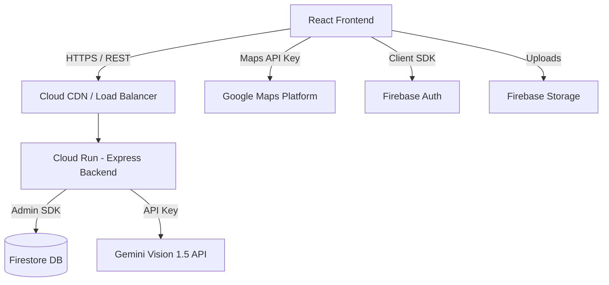
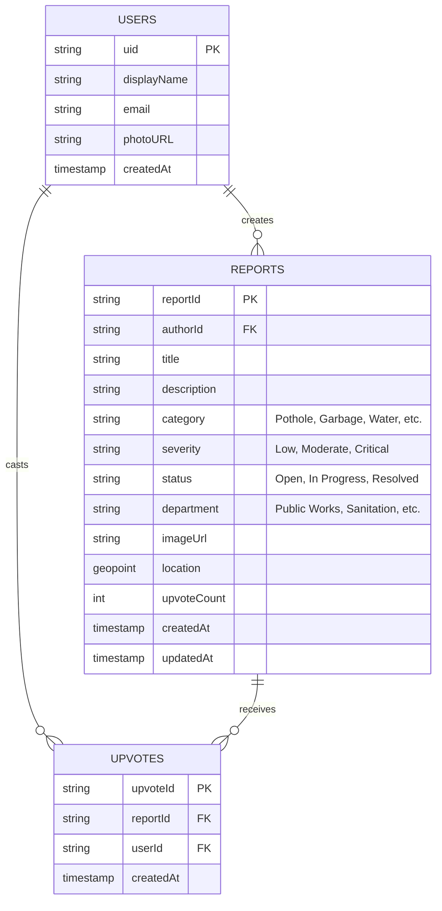
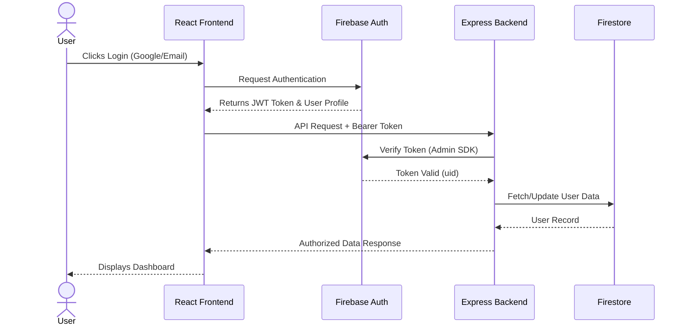
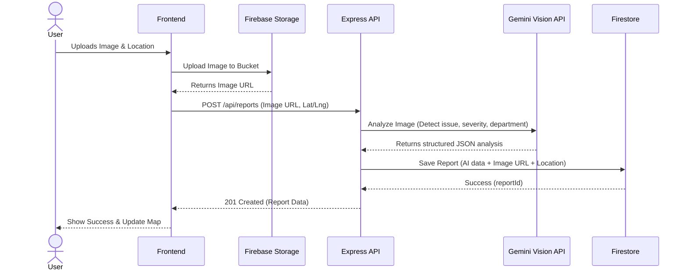

# CivicConnect AI Architecture

## 1. System Architecture & Deployment

CivicConnect AI is built as a full-stack application using React (Vite) for the frontend and Express (Node.js) for the backend, deployed on Google Cloud Run. It leverages Firebase for authentication and database, and Google Maps for location services.



## 2. Folder Structure

The project follows a modular, feature-based folder structure to ensure maintainability and scalability.

```text
/
├── .env.example              # Environment variables template
├── package.json              # Project dependencies and scripts
├── server.ts                 # Express backend entry point
├── vite.config.ts            # Vite build configuration
├── src/                      # Frontend source code
│   ├── components/           # Reusable UI components
│   │   ├── common/           # Buttons, inputs, modals
│   │   ├── map/              # Google Maps components
│   │   └── reports/          # Report cards, feeds
│   ├── hooks/                # Custom React hooks (e.g., useAuth, useReports)
│   ├── lib/                  # Utility functions and configurations
│   │   ├── firebase.ts       # Firebase client initialization
│   │   └── utils.ts          # Helper functions (formatting, validation)
│   ├── pages/                # Page-level components
│   │   ├── Dashboard.tsx     # Main application view
│   │   ├── ReportIssue.tsx   # Issue reporting flow
│   │   └── Auth.tsx          # Login/Signup view
│   ├── types/                # TypeScript interfaces and types
│   ├── App.tsx               # Main React application component
│   └── main.tsx              # React DOM entry point
└── dist/                     # Compiled production build
```

## 3. Database Schema & Firestore Collections

We use Firebase Firestore as a NoSQL database.



## 4. Authentication Flow

Firebase Authentication is used to secure the application.



## 5. API Flow (Issue Reporting)

When a user submits a report, the backend orchestrates image uploads and AI analysis.



## 6. Gemini Integration

The Gemini Vision 1.5 Pro model acts as the core intelligence layer. It is accessed securely from the Node.js backend to prevent exposing the API key to the client.

- **Input:** Image URL (or base64) and context (e.g., location data).
- **Prompt:** "Analyze this image of a civic issue. Identify the type of issue (pothole, garbage, etc.), estimate severity (Low, Moderate, Critical), generate a professional complaint description, and recommend the responsible government department."
- **Output:** Structured JSON containing `category`, `severity`, `description`, `department`, and `multilingual_descriptions`.

## 7. Google Maps Integration

The `@vis.gl/react-google-maps` library is used for a declarative map experience.

- **Map View:** Displays the city or user's current location.
- **Markers:** Custom markers represent reports. Marker colors correspond to the AI-predicted severity (e.g., Red = Critical, Amber = Moderate, Green = Resolved).
- **Interactions:** Clicking a map marker opens a bottom sheet or side panel with the full report details fetched from Firestore.
